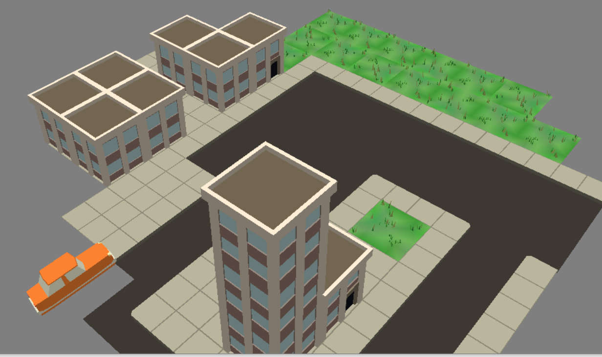

# Car in city

Author: (Ruian Pan)

Design: 
The car is moving in the city. However the control is very clunky. Try to move to end of block to win.

Screen Shot:

How To Play:

press q and e to rotate
1,2,3,4 for movement acceleration adjustment, goal is to reach bottom right of the city

Sources: provided blender assets

This game was built with [NEST](NEST.md).

